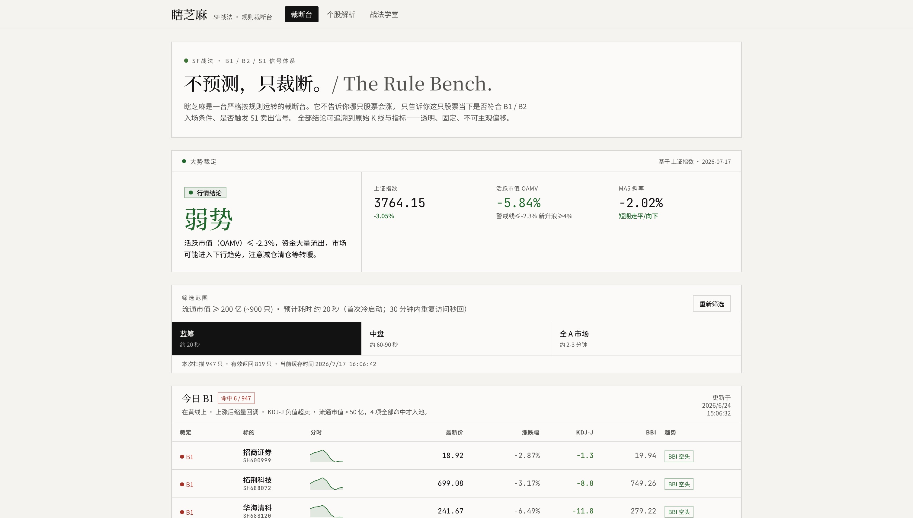

# 瞎芝麻

基于 **SF 战法 B1 / B2 / S1 信号体系**的 A 股规则裁断 Web 应用。项目通过固定、可追溯的量化规则展示市场状态、股票筛选结果和单股指标拆解。

> 不预测，只裁断。瞎芝麻仅提供基于公开行情数据的规则计算与信息展示，不构成投资建议，不承诺收益，也不对任何交易损失负责。

[在线演示](https://xiazhima.vercel.app) · [问题反馈](https://github.com/Iman-GGG/xiazhima/issues) · [贡献指南](./CONTRIBUTING.md) · [安全政策](./SECURITY.md) · [路线图](./ROADMAP.md) · [Apache-2.0 License](./LICENSE)



## 项目能力

- 大势裁定：结合上证指数、活跃市值（OAMV）与 MA5 斜率展示市场状态。
- 每日筛选：按蓝筹、中盘和全 A 等范围执行规则化筛选。
- 信号体系：计算并展示 B1、B2、单针下三十和 S1 条件。
- 个股解析：按股票代码或名称搜索，查看 K 线、指标和逐项规则判定。
- 战法学堂：公开展示当前系统采用的规则、指标含义和风险边界。
- 预计算与缓存：支持收盘后预计算，以及内存、文件或 KV 缓存。
- 管理员维护：通过受保护的后台更新 OAMV、触发预计算并查看状态。

## 当前边界

- 行情来自第三方公开接口，可能因网络、数据源调整、停牌或新股样本不足而延迟或失败。
- 筛选结论是固定规则的程序化结果，不代表未来价格走势。
- 项目不存储用户交易数据，不连接券商账户，也不执行自动交易。
- 在线演示的可用性和数据刷新频率不作服务等级保证。
- 管理后台必须显式配置密码和会话密钥；缺少配置时登录保持关闭。

## 技术栈

- Next.js 16（App Router）
- React 19
- TypeScript 5
- Tailwind CSS 4
- shadcn/ui 与 Radix UI
- Recharts
- Vitest
- pnpm

## 本地运行

### 环境要求

- Node.js 20 或更高版本
- pnpm 9 或更高版本

本项目仅使用 pnpm 管理依赖。

```bash
git clone https://github.com/Iman-GGG/xiazhima.git
cd xiazhima
pnpm install
pnpm dev
```

默认访问地址：<http://localhost:5000>

### 常用命令

```bash
pnpm dev          # 启动开发服务器
pnpm test         # 运行规则单元测试
pnpm ts-check     # TypeScript 类型检查
pnpm lint:build   # ESLint 检查
pnpm validate     # 并行执行类型与 lint 检查
pnpm build        # 构建 Next.js 与自定义服务端
pnpm start        # 启动生产服务
```

## 环境变量

不要将真实密码、令牌或 `.env` 文件提交到仓库。

| 变量 | 必需性 | 用途 |
| --- | --- | --- |
| `ADMIN_PASSWORD` | 使用管理员后台时必需 | 管理员登录密码；未配置时登录关闭 |
| `ADMIN_SESSION_SECRET` | 使用管理员后台时必需 | 管理员 Cookie 签名密钥；应使用高强度随机值 |
| `PRECOMPUTE_SECRET` | 可选 | 通过 `x-precompute-secret` 请求头授权预计算任务 |
| `KV_REST_API_URL` | 可选 | 远程 KV 缓存地址 |
| `KV_REST_API_TOKEN` | 可选 | 远程 KV 缓存访问令牌 |

本地开发可以在 `.env.local` 中配置变量。生产部署请使用托管平台的加密环境变量功能。

## 目录结构

```text
src/
├── app/                    # 页面、布局和 API 路由
├── components/feature/     # 业务界面组件
├── components/ui/          # 通用 UI 组件
└── lib/
    ├── stock/              # 指标、信号、行情获取与预计算
    ├── admin-auth.ts       # 管理员鉴权
    └── admin-store.ts      # 管理配置存储
scripts/                    # 开发、验证、构建和启动脚本
docs/                       # 公开项目文档
```

规则实现的主要入口：

- `src/lib/stock/indicators.ts`：BBI、KDJ、量价与形态指标。
- `src/lib/stock/b1.ts`：B1、B2、单针下三十、S1 与大势判定。
- `src/lib/stock/fetcher.ts`：公开行情数据获取与解析。
- `src/lib/stock/precompute.ts`：收盘后筛选、缓存和状态管理。

## 数据与合规说明

项目当前使用腾讯财经公开行情接口获取 K 线与快照数据。第三方数据的权利、准确性、稳定性及使用限制由相应提供方负责；部署者应自行确认其使用方式符合适用条款和法律要求。

本项目及其维护者不提供证券投资顾问服务。任何示例、信号、文字说明和在线结果仅用于软件研究、规则验证与信息展示。请勿仅依据本项目作出投资决定。

## 参与贡献

欢迎通过 Issue 报告可复现的问题、讨论规则实现或提出文档改进。涉及交易规则的改动应同时提供：

1. 清晰的规则来源或推导依据；
2. 可复现的输入样本；
3. 对应的测试用例；
4. 对现有行为和风险提示的影响说明。

提交代码前请阅读 [贡献指南](./CONTRIBUTING.md)。安全漏洞请按照 [安全政策](./SECURITY.md) 私下报告；计划中的工作与明确边界见 [项目路线图](./ROADMAP.md)。

## 维护者

项目由 [@Iman-GGG](https://github.com/Iman-GGG) 发起并维护。

## 许可证

代码以 [Apache License 2.0](./LICENSE) 开源。第三方数据、品牌、规则资料和外部服务仍受其各自条款约束。
